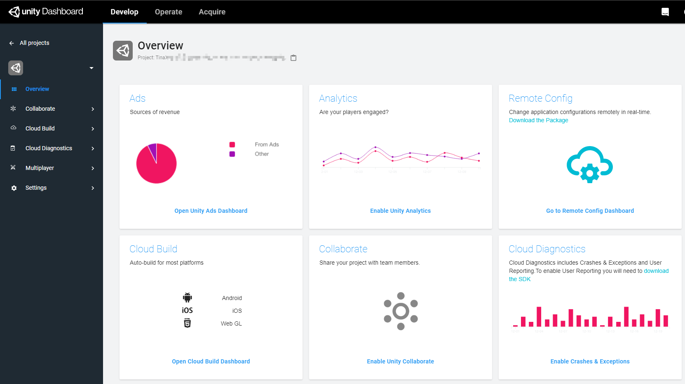
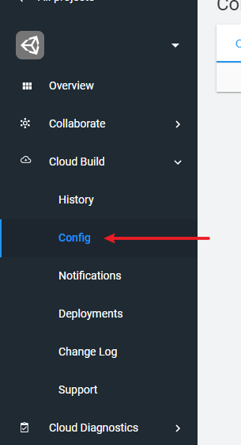
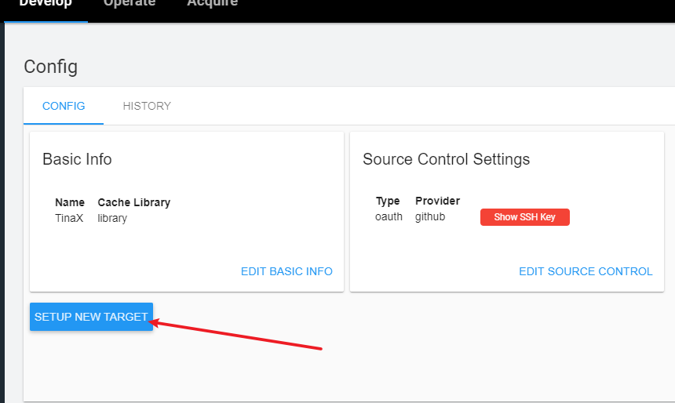
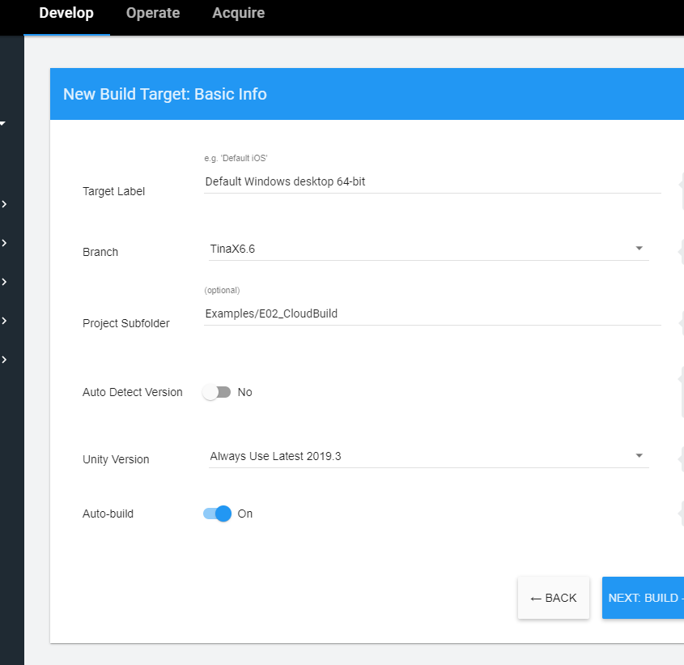
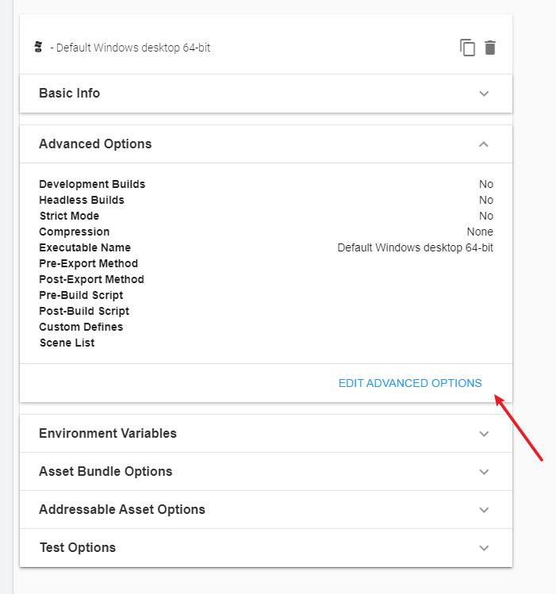
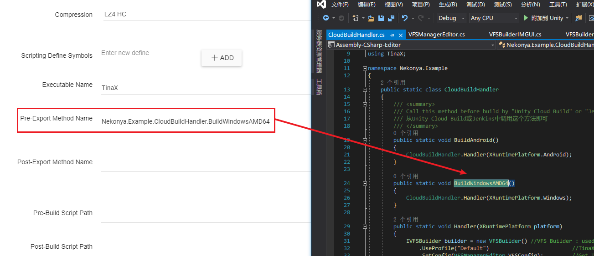

# TinaX Example - Cloud Build (C# Only)

- Unity : 2019.3.12f1
- TinaX.Core : alpha
- TinaX.VFS : alpha
- TinaX.XComponent : alpha
- TinaX.UIKit : alpha
- TinaX.I18N : alpha

This demo demonstrates how to use `Unity Cloud Build` to automatically build projects.

This demo use C# pre-process assetbundles by `TinaX.VFS` before `Unity Cloud Build` build project.

These same principles can be applied to workflows like Jenkins, Azure DevOps, Gitlab.

 

这个Demo演示了如何通过`Unity Cloud Build` 对项目进行自动化构建。它将使用C#操作`TinaX.VFS`在项目被编译前进行AssetBundle打包等一系列操作。

类似的思路同样也可适用于`Jenkins`、`Azure DevOps`、`Gitlab`等工作流

## How to configure it in `Unity Build Cloud`

First, Create a new project in `Unity Dashboard`

and select menu : "Cloud Build -> Config" .

Configure your  project origin , such as `git` or `svn`. 

Then , Setup new target:

### Advanced Options!

Finished.