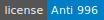
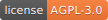

# TinaX

Documentation is being written.

> Sorry, English is not the author ’s native language, writing English documentation is more difficult for the author. 
>
> This means that English documents will be completed slightly later than **[Chinese documents 中文文档](README_CN.md)**. 
>
> If you can, please help us to participate in the preparation of English documentation.

Unity-based Game Client Framework

<!--  -->

TinaX Framework is a simple, complete, out-of-the-box development framework based on the Unity engine. TinaX's goal is to be a framework that adapts to different project and team sizes.
- Support all Unity target platforms except WebGL
- Use C#/Lua to develop games and support hot code updates
- Introduce the various modules of the project as needed and replace them freely
- "Asynchronous First" design concept
- "Interface-oriented" weak coupling design

 

## Environmental Requirements

**Unity**
- Version used to develop TinaX: `Unity 2019.4.0f1`
- Recommended version for production: `Unity 2019.4.x LTS`
- Minimum compatible version of theory: `Unity 2019.4.x`

**C#**
- Unity Api Compatibility Level: `.NET 4.X`/`.NET Standard 2.0` 
- C# `7.2`

 

## Community communication

- You can initiate Issues and Pull requests on Github.
- Telegram Group: [https://t.me/tinax_framework](https://t.me/tinax_framework)

 

## Learn TinaX

**Packages**: TinaX Framework uses `Unity packages` to organize and manage the modules of each function. By installing different Packages, you can add different functional modules to the project. No matter what stage your project is in, you can easily access TinaX.

**Example**： You can view [Example Project](https://github.com/yomunsam/TinaX/tree/TinaX6.6/Examples) in this repository

The description of each Packages is as follows:

### TinaX.Core

`TinaX.Core` is the basic package of TinaX. It is responsible for startup and managing all services, providing common basic functions, providing event system, dependency injection, etc.

- Repository: [https://github.com/yomunsam/TinaX.Core](https://github.com/yomunsam/TinaX.Core)
- Package Name: `io.nekonya.tinax.core`

 

### TinaX.VFS

Virtual File System (VFS) is TinaX's assets management service. It simulates the directory structure of "`Assets/xxx`" in the Unity project at runtime, and implements assets loading, dependency management, version management and update, memory gc, etc.

- Repository: [https://github.com/yomunsam/TinaX.VFS](https://github.com/yomunsam/TinaX.VFS)
- Package Name: `io.nekonya.tinax.vfs`

 

### TinaX.UIKit

`UIKit` provides uGUI-based UI management services for TinaX, such as open, close, hide the UI, avoiding full-screen UIs from each other, and UI startup parameters.

And it provides related content such as component extensions and extensible UI animations.

- Repository: [https://github.com/yomunsam/TinaX.UIKit](https://github.com/yomunsam/TinaX.UIKit)
- Package Name: `io.nekonya.tinax.uikit`

 

### TinaX.I18N

I18N (Internationalized) support services based on the form of `key / value` make your application more friendly to users in different languages and regions around the world.

- Repository: [https://github.com/yomunsam/TinaX.I18N](https://github.com/yomunsam/TinaX.I18N)
- Package Name: `io.nekonya.tinax.i18n`

 

### TinaX.Lua

Provides Lua language runtime for TinaX. This service is based on `Tencent/xLua`.

- Repository: [https://github.com/yomunsam/TinaX.Lua](https://github.com/yomunsam/TinaX.Lua)
- This content needs to be directly imported into the project `Assets` directory, not provided as a package.

 

### TinaX.ILRuntime

Provides hot-updatable C# runtime for TinaX. The service is based on `ILRuntime`.

- Repository: [https://github.com/yomunsam/TinaX.ILRuntime](https://github.com/yomunsam/TinaX.ILRuntime)
- Package Name: `io.nekonya.tinax.ilruntime`

 

------

 

 

## Excellent Unity project recommendation

- **[QFramework](https://github.com/liangxiegame/QFramework)** : Your first K.I.S.S Unity 3D Framework.
- **[xasset](https://github.com/xasset/xasset)** : A lightweight assets management framework.
- **[CatLib](https://github.com/CatLib/Core)** : CatLib lightweight dependency injection container